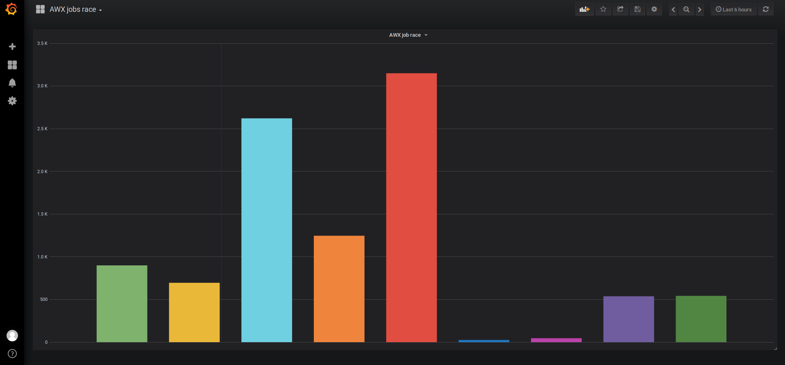

# awx-job-race

This ansible role get the amount of jobs launched by all users in AWX and put this data in a influxdb.
Is possible to use a grafana for print a dashboard like this


### Variable to be set

- inventories/awx_jobs_stats/all_vars.yml

influxdb_ip_address: "http://<INFLUXDB_HOSTNAME>:8086"
influxdb_database_name: "awx_job_race"
awx_hostname: "<AWX_HOSTNAME>"

- inventories/awx_jobs_stats/all_vault.yml

awx_user: "admin"
awx_pass: "password"

### Use

```bash
ansible-playbook --ask-vault-pass --tags=stats main.yml
```

